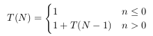
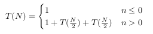
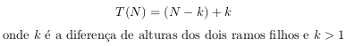
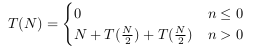

# Ficha 3 - Estruturas de Dados

## 1 - Árvores binárias de procura

Definição de uma árvore:
```C
struct btree {
    int value;
    struct btree *left;
    struct btree *right;
} * Btree;
```

### 1
#### a) `int size(Btree)`

```C
int size(Btree tree) {
    if(tree != NULL) {
        return 1 + size(tree->left) + size(tree->right);
    }
    return 0;
}
```

- **(i)**

  

- **(ii)**

  

O melhor e pior caso são iguais visto que temos sempre de ver toda a árvore, independentemente de estar ou não equilibrada: Θ(N) linear.

#### b) `int altura (Btree)`

```C
int altura(Btree tree) {
    if(tree != NULL) {
        int aLeft = altura(tree->left);
        int aRight = altura(tree->right);
        if(aLeft > aRight) return 1 + aLeft;
        else return 1 + aRight;
    }
    return 0;
}
```

- **(i)**

  

- **(ii)**

  

O melhor e pior caso são iguais visto que temos sempre de ver toda a árvore, independentemente de estar ou não equilibrada: Θ(N) linear.

#### c) `int add(BTree tree, int value)`

```C
BTree add(BTree tree, int value) {
    if(tree == NULL) {
        Btree new = malloc(sizeof(struct btree));
        new->right = NULL;
        new->left = NULL;
        new->value = value;
        return new;
    } else if(tree->value > value) {
        add(tree->left, value);
    } else {
        add(tree->right, value);
    }
    return tree;
}
```

- **(i)**

  Se a árvore estiver perfeitamente desequilibrada (assumindo que a árvore esta desequilibrada para a direita), o melhor caso é a inserção a cabeça, ou seja, o elemento que vai ser inserido é menor que o elemento a cabeça Θ(1). O pior caso é o oposto, o elemento a inserir é maior do que qualquer outro, tendo de se percorrer toda a árvore para o inserir: Θ(N).

  

- **(ii)**

  O melhor e pior caso são iguais quando a árvore este equilibrada, visto que temos sempre de percorrer log_2(N) elementos para inserir.

  

#### d) `int search(Btree tree, int value)`

```C
int search(BTree tree, int value) {
    if(tree == NULL) return 0;
    if(tree->value == value) return 1;
    else if(tree->value > value) return search(tree->left, value);
    else return search(tree->right, value);
}
```

- **(i)**

  Mais uma vez, para uma árvore perfeitamente desequilibrada (assumindo que está desequilibrada para a direita) o melhor caso é que o elemento está no topo da árvore ou é menor que qualquer elemento da árvore: Θ(1). O pior caso é que o elemento que procuramos é o maior da árvore ou é maior do que qualquer elemento que existe na árvore, para terminar a pesquisa temos de ver toda a árvore.

  


- **(ii)**
  Para uma árvore equilibrada, o melhor caso é que o elemento se encontre à cabeça da árvore: Θ(1), o pior caso é que o elemento está numa das folhas da árvore (elementos extremos). Para este caso temos a seguinte recorrência: Θ(log_2(N))

  

#### e) `int max(BTree tree)`

```C
int max(Btree tree) {
    // Nao vazia implica que nao temos de verificar tree == NULL
    while(tree->right != NULL) {
        tree = tree->right;
    }
    return tree->value;
}
```

- **(i)**
  Para uma árvore desequilibrada o melhor caso é que esteja desequilibrada para a esquerda, assim o maior elemento está logo a cabeça: Θ(1), o pior caso é o oposto, a árvore está desequilibrada para a direita e portanto temos de percorrer toda a estrutura para obter o maior elemento: Θ(N)

  

- **(ii)**
  Se a árvore estiver equilibrada, o melhor e pior casos são o mesmo, temos de percorrer log_2(N) elementos para obter o maior da árvore.

  

### 2

```C
int balanceada (BTree a) {
    if (a) {
        l = altura (a->left);
        r = altura (a->right);
        return abs(l-r) <= 1
            && balanceada (a->left)
            && balanceada (a->right);
    }
    else return 1;
}
```

_Assumindo que a função `altura` executa em Θ(N)_

#### a) b)

_Melhor caso:_

O melhor caso para esta função é que a diferença de alturas entre as os filhos da cabeça da árvore é maior do que 1. Assim a função retorna imediatamente porque `abs(l-r) <= 1` será falso.



Que é claramente Θ(N).

_Pior caso:_

O pior caso é quando a árvore está balanceada e então tem de ser completamente verificada.



Que tem complexidade Θ(N · log_2(N))

#### c)

```C
int balanceada(BTree a) {
    int p;
    return balanceadaAux(a, &p);
}

int balanceadaAux(BTree a, int *p) {
    int l, r;
    if(a != NULL) {
        int bL = balanceadaAux(a->left, &l);
        int bR = balanceadaAux(a->right, &r);
        *p = r + l + 1;
        return abs(r-l) <= 1 && bL && bR;
    } else {
        *p = 0;
        return 1;
    }
}
```

  => Θ(N) para qualquer caso.


