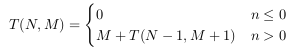
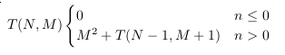

# Ficha 3 - Estruturas de Dados

**Indice**
- [Árvores binárias de procura](./Ficha3.md#1---árvores-binárias-de-procura)
- [Filas com prioridades e *Heaps*](./Ficha3.md#2---filas-com-prioridades-e-heaps)

## 1 - Árvores binárias de procura

Definição de uma árvore:
```C
struct btree {
    int value;
    struct btree *left;
    struct btree *right;
} * Btree;
```

### 1
#### a) `int size(Btree)`

```C
int size(Btree tree) {
    if(tree != NULL) {
        return 1 + size(tree->left) + size(tree->right);
    }
    return 0;
}
```

- **(i)**

  

- **(ii)**

  

O melhor e pior caso são iguais visto que temos sempre de ver toda a árvore, independentemente de estar ou não equilibrada: Θ(N) linear.

#### b) `int altura (Btree)`

```C
int altura(Btree tree) {
    if(tree != NULL) {
        int aLeft = altura(tree->left);
        int aRight = altura(tree->right);
        if(aLeft > aRight) return 1 + aLeft;
        else return 1 + aRight;
    }
    return 0;
}
```

- **(i)**

  

- **(ii)**

  

O melhor e pior caso são iguais visto que temos sempre de ver toda a árvore, independentemente de estar ou não equilibrada: Θ(N) linear.

#### c) `int add(BTree tree, int value)`

```C
BTree add(BTree tree, int value) {
    if(tree == NULL) {
        Btree new = malloc(sizeof(struct btree));
        new->right = NULL;
        new->left = NULL;
        new->value = value;
        return new;
    } else if(tree->value > value) {
        tree->left = add(tree->left, value);
    } else {
        tree->right = add(tree->right, value);
    }
    return tree;
}
```

- **(i)**

  Se a árvore estiver perfeitamente desequilibrada (assumindo que a árvore esta desequilibrada para a direita), o melhor caso é a inserção a cabeça, ou seja, o elemento que vai ser inserido é menor que o elemento a cabeça Θ(1). O pior caso é o oposto, o elemento a inserir é maior do que qualquer outro, tendo de se percorrer toda a árvore para o inserir: Θ(N).

  

- **(ii)**

  O melhor e pior caso são iguais quando a árvore este equilibrada, visto que temos sempre de percorrer log_2(N) elementos para inserir.

  

#### d) `int search(Btree tree, int value)`

```C
int search(BTree tree, int value) {
    if(tree == NULL) return 0;
    if(tree->value == value) return 1;
    else if(tree->value > value) return search(tree->left, value);
    else return search(tree->right, value);
}
```

- **(i)**

  Mais uma vez, para uma árvore perfeitamente desequilibrada (assumindo que está desequilibrada para a direita) o melhor caso é que o elemento está no topo da árvore ou é menor que qualquer elemento da árvore: Θ(1). O pior caso é que o elemento que procuramos é o maior da árvore ou é maior do que qualquer elemento que existe na árvore, para terminar a pesquisa temos de ver toda a árvore.

  


- **(ii)**
  Para uma árvore equilibrada, o melhor caso é que o elemento se encontre à cabeça da árvore: Θ(1), o pior caso é que o elemento está numa das folhas da árvore (elementos extremos). Para este caso temos a seguinte recorrência: Θ(log_2(N))

  

#### e) `int max(BTree tree)`

```C
int max(Btree tree) {
    // Nao vazia implica que nao temos de verificar tree == NULL
    while(tree->right != NULL) {
        tree = tree->right;
    }
    return tree->value;
}
```

- **(i)**
  Para uma árvore desequilibrada o melhor caso é que esteja desequilibrada para a esquerda, assim o maior elemento está logo a cabeça: Θ(1), o pior caso é o oposto, a árvore está desequilibrada para a direita e portanto temos de percorrer toda a estrutura para obter o maior elemento: Θ(N)

  

- **(ii)**
  Se a árvore estiver equilibrada, o melhor e pior casos são o mesmo, temos de percorrer log_2(N) elementos para obter o maior da árvore.

  

### 2

```C
int balanceada (BTree a) {
    if (a) {
        l = altura (a->left);
        r = altura (a->right);
        return abs(l-r) <= 1
            && balanceada (a->left)
            && balanceada (a->right);
    }
    else return 1;
}
```

_Assumindo que a função `altura` executa em Θ(N)_

#### a) b)

_Melhor caso:_

O melhor caso para esta função é que a diferença de alturas entre as os filhos da cabeça da árvore é maior do que 1. Assim a função retorna imediatamente porque `abs(l-r) <= 1` será falso.


Que é claramente Θ(N).

_Pior caso:_

O pior caso é quando a árvore está balanceada e então tem de ser completamente verificada.


Que tem complexidade Θ(N · log_2(N))

#### c)

```C
int balanceada(BTree a) {
    int p;
    return balanceadaAux(a, &p);
}

int balanceadaAux(BTree a, int *p) {
    int l, r;
    if(a != NULL) {
        int bL = balanceadaAux(a->left, &l);
        int bR = balanceadaAux(a->right, &r);
        *p = r + l + 1;
        return abs(r-l) <= 1 && bL && bR;
    } else {
        *p = 0;
        return 1;
    }
}
```

  => Θ(N) para qualquer caso.


## 2 - Filas com prioridades e *Heaps*

```C
typedef struct buffer *Buffer;

Buffer init  (void);         //inicia e aloca espaço
int    empty (Buffer);       //testa se esta vazio
int    add   (Buffer, int);  //acrescenta elemento
int    next  (Buffer, int *);//proximo a sair
int    remove(Buffer, int *);//remove proximo
```

### 1
#### a)
*Assume-se que o "proximo a sair" é o maior elemento do buffer*

**A**

A inserção pode ser Θ(1), no melhor caso, se for inserido no fim do *buffer*, ou seja, é o maior de todos os elementos, no pior caso, é inserir um elemento menor do que qualquer outro, pois temos de mover todos os elementos para que "caiba" o menor, Θ(N).

A remoção, assumindo que queremos remover o maior de todos os elementos, é sempre Θ(1). Só temos de remover o ultimo e não é necessário realiza mais nenhuma operação.

Para uma sequência de N instruções o melhor caso é que as inserções sejam feitas por ordem crescente, assim todas as inserções serão Θ(1). Como todas as remoções são também Θ(1) temos que o tempo de execução no melhor caso é: Θ(N).

Para o pior caso, os elementos serem inseridos por ordem decrescente, isto implica que, para 2N instruções, cada inserção demora Θ(M), para M igual ao número de elementos do array.



Esta recorrência de Θ(N<sup>2</sup>) define o custo de fazer as inserções. As remoções são sempre Θ(1) e portanto todas juntas são Θ(N). No total temos Θ(N<sup>2</sup> + N) que é Θ(N<sup>2</sup>).

**B**

As inserções são sempre feitas em tempo Θ(1), visto que a ordem mantida é a ordem de chegada, só temos de colocar o novo elemento na "ponta".

As remoções no entanto são mais custosas. No melhor caso, o maior elemento é o ultimo elemento inserido, neste caso, a remoção é Θ(N) porque temos de percorrer todo o array para encontrar o maior. Para o pior caso, o maior elemento foi o primeiro a ser inserido, temos de percorrer o array, Θ(N), e depois mover todos os elementos um índice para trás para remover o primeiro do *buffer*. Logo o tempo total é Θ(N<sup>2</sup>).

Para uma sequência de 2N instruções, o melhor caso é quando as inserções são feitas por ordem crescente, assim as remoções demoram todas Θ(M).


Esta recorrência descreve o tempo de execução das N remoções para um array de tamanho M, e como a anterior é Θ(N<sup>2</sup>). Sendo que as inserções e remoções demoram N<sup>2</sup> + N que é Θ(N<sup>2</sup>).

No pior caso as inserções são feitas por ordem decrescente, e portanto as remoções passam a ter todas Θ(N<sup>2</sup>).



Esta recorrência tem Θ(N<sup>3</sup>) e portanto toda a sequência de instruções tem Θ(N<sup>3</sup>).

### 2
```C
#define PARENT(i) (2*i + 1) // o indice do array começa em 0
#define LEFT(i)   (2*i + 2)
#define RIGHT(i)  ((i-1)/2)

typedef int Elem; // elementos da heap.

typedef struct {
    int size;
    int used;
    Elem *values;
} Heap;

Heap* newHeap   (int size);
int   insertHeap(Heap *h, Elem x);
void  bubbleUp  (Elem h[], int i);
int   extractMin(Heap *h, Elem *x);
void  bubbleDown(Elem h[], int N);
```

#### c)
```C
Head *newHeap(int size) {
    Heap * heap = malloc(sizeof(Heap));
    heap->size = size;
    heap->used = 0;
    heap->values = malloc(sizeof(Elem)*size);
}
```

```C
int insertHeap(Heap *h, Elem x) {
    heap->values[heap->used] = x;
    bubbleUp(heap->values, heap->used);
    heap->used++;
}
```

```C
void bubbleUp(Elem h[], int i) {
    while(i != 0 && h[RIGHT(i)] > h[i]) {
        swap(h, RIGHT(i), i);
        i = PARENT(i);
    }
}
```

```C
int extractMin(Heap *h, Elem *x) {
    if(h->used < 1) return 0;
    *x = heap->values[0];
    heap->used--;
    swap(heap->values, 0, heap->used);
    bubbleDown(heap->values, heap->used);
}
```

```C
void bubbleDown(Elem h[], int N) {
    while(LEFT(i) < N && RIGHT(i) < N) {
        int smallest;
        if(h[LEFT(i)] <= h[RIGHT(i)] && h[LEFT(i)] < h[i]) {
            smallest = LEFT(i);
        } else if(h[RIGHT(i)] <= h[LEFT(i)] && h[RIGHT(i)] < h[i]) {
            smallest = RIGHT(i);
        } else {
            break;
        }
        swap(h, i, smallest);
        i = smallest;
    }
    if(LEFT(i) < N && h[i] > h[LEFT(i)]){
        swap(h, i , LEFT(i));
    }
}
```
