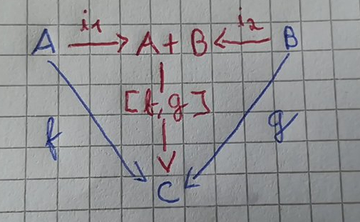

# Either (mesmo codominio)

À semelhança do que aconteceu com o `split`, onde combinamos funções com o mesmo domínio, é possivel combinar funções com o mesmo codominio (contradominio).

Tendo duas funções, `f` e `g` e tal que `f : A -> C` e `g : B -> C`, podemos representar estas funções da seguinte forma:


Aplicamos `f` caso apareça um valor do tipo `A` e aplicamos `g` caso apareça um valor do tipo `B`. O símbolo utilizado para representar isto é `[f, g]`.


Podemos combinar os dominios destas duas funções, para isso é necessário uma marca a indicar de que tipo (conjunto) vem o valor (se do `A` ou do `B`). Para marcar de que tipo o valor vem usamos injeções.


Em Haskell já existe um tipo de dados que serve perfeitamente para fazer estas injeções. O `Either` representa ou um valor ou outro, marcando-os com `Left` ou `Right`.
```haskell
data Either a b = Left a | Right b
```

`i1` e `i2` usados nos diagramas são apenas alcunhas para `Left` e `Right`. Surge então este diagrama:



## Haskell

Como vimos o `Either` ja esta definido em Haskell.

```haskell
-- Apenas mudamos os nomes para bater certo com os diagramas
i1      = Left
i2      = Right
```
