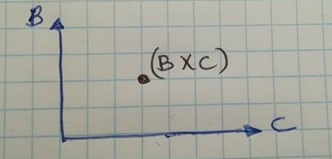
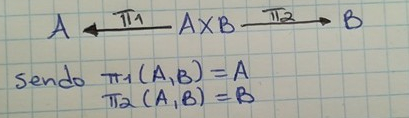
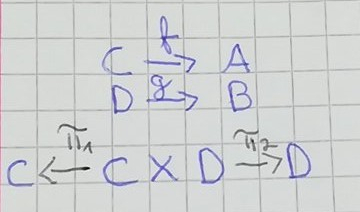
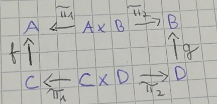
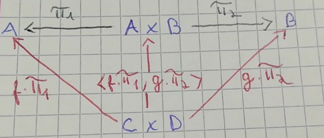

# Split (mesmo dominio)

Se tivermos duas funções, `f` e `g`, `f : A -> B` e `g : A -> C`, podemos representar as funções da seguinte forma:


Podemos também juntar os seus outputs visto que `f` e `g` partiham o mesmo dominio. `(f(a), g(a))` para `a` pertencente a `A`. Estes pares,ou seja, vários valores concretos de `a`, pertencem ao produto cartesiano de `B` e `C`.



É então natural pensar numa operação que agrupa tanto os outputs de `f` como os outputs de `g`.
Surge portanto, `<f, g>` onde `<f, g>a = (f(a), g(a))`.
`<f, g>` é pronunciado `f split g`.

Visto que `<f, g>` mantém a informação tanto de `f` como de `g` podemos obter a informação de `B` como de `C` a partir de `B >< C` através de projeções:



Podemos obter `f` como  `p1 . <f, g>` e `g` como  `p2 . <f, g>`. Sendo que p significa π.
Juntando tudo num gráfico temos:


## Haskell

Vamos ver como isto se implementa em Haskell.

```haskell
-- p significa Pi

p1        = fst  -- fst (a, b) = a
p2        = snd  -- snd (a, b) = b

-- Dado duas funções que partem de um elemento `x` que pertence ao dominio `a`
-- Chegamos a um par `(f x, g x)` que pertence do dominio B><C ou `(b, c)`

split :: (a -> b) -> (a -> c) -> a -> (b,c)
split f g x = (f x, g x)
```

# Split (dominio diferente)

Há casos de funções que não partilham o mesmo domninio, `f : C -> A` e `g : D -> B`, sendo que `<f, g>` deixa de ser válido. Note que as funções não "tipam".

Uma forma de aplicar o `split` a estas funções é juntar os seus dominios atráves do produto cartesiano dos mesmos `C >< D`. Desta maneira podemos tratar `C` como a projeção `p1` e `D` como a projeção `p2`.



Surge então este diagrama:



É possivel derivar este segundo diagrama, onde podemos mapear `C >< D` para `A >< B` atráves de `<f . p1, g . p2>`



`<f . p1, g . p2>` coresponde a paralelismo puro ou total e aparece tantas vezes que tem um simbolo próprio: `f >< g`.


## Haskell

Mais uma vez é só seguir a definição!

```haskell
-- f >< g = <f . pi, g . p2>

-- Tendo uma função de A para B e outra de C para D
-- Agrupando os dominios chegamos aos contradominios agrupados

(><) :: (a -> b) -> (c -> d) -> (a,c) -> (b,d)
f >< g = split (f . p1) (g . p2)

```
