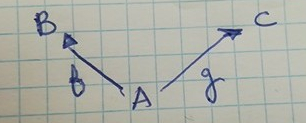
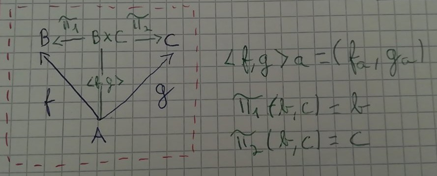

# Split (mesmo dominio)

Se tivermos duas funções, `f` e `g`, que mapeiam de `A` para `B` e `C` respectivamente, podemos representar as funções da seguinte forma:



Podemos também juntar os seus outputs visto que `f` e `g` partiham o mesmo dominio. `(f(z), g(z))` para `z` pertencente a `A`. Estes pares,ou seja, vários valores concretos de `z`, pertencem ao produto cartesiano de `B` e `C`.


É então natural pensar numa operação que agrupa tanto os outputs de `f` como os outputs de `g`.
Surge portanto, `<f,g>` onde `<f,g>z = (f(z), g(z))`.
`<f,g>` é pronunciado `f split g`.

Visto que `<f ,g>` mantém a informação tanto de `f` como de `g` podemos obter a informação de `B` como de `C` a partir de `B >< C` através de projeções:


Podemos obter `f` como  `p1 . <f, g>` e `g` como  `p2 . <f, g>`. Sendo que p significa Pi.
Juntando tudo num gráfico temos:



# Haskell

Vamos ver como isto se implementa em Haskell.

```haskell
-- p significa Pi
p1        = fst  -- fst (a, b) = a
p2        = snd  -- snd (a, b) = b

split :: (a -> b) -> (a -> c) -> a -> (b,c)
split f g x = (f x, g x)
```
