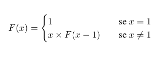
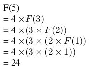

# Recursividade

> *To understand recursion, you first need to understand recursion.*

O factorial de um número é um classico exemplo de recursividade.

Sabendo que o factorial de `1` é `1` e que o factorial de `3` é igual a `3` vezes o factorial de `2`:

`1! = 1`

`3! = 3 * 2!`

Podemos então definir uma função que descreve o factorial:



Esta função é recursiva, pois é definida à custa dela própria.

Como exemplo, vamos calcular o valor de `F(4)`, como para qualquer função temos apenas de substituir `F(4)` pela definição.



Agora para definir-mos isto em `Haskell` é bastante similar:

```Haskell
factorial :: Int -> Int
factorial 1 = 1
factorial x = x * factorial (x - 1)
```

Podemos calcular o factorial de 4 com esta definição também:

```Haskell
factorial 4
= 4 * factorial 3
= 4 * (3 * factorial 2)
= 4 * (3 * (2 * factorial 1))
= 4 * (3 * (2 * 1))
= 4 * (3 * 2)
= 4 * 6
= 24
```
