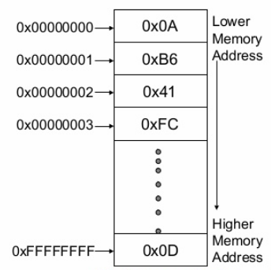

> Os resumos que se seguem são maioritariamente relativos a arquiteturas **IA-32** e, consequentemente, o que for dito não se verifica necessariamente para as outras arquiteturas.

Um computador é constituído por diversos componentes, mas 
aqueles que vou abordar são maioritariamente a **Unidade de 
Processamento (PU)** e a **Memória Primária**.A unidade de 
processamento subdivide-se em diversos componentes, entre os quais, o 
**Banco de Registos**.
O **Banco de Registos** e a **Memória Primária** têm ambos a 
função de armazenar informação. Diferem quanto à forma de 
organização e à localização e, consequentemente, quanto à rapidez de 
acesso. 

## **Memória**

A memória está organizada em células, cada uma com capacidade 
para **1 byte (8 bits)**. Se estivermos a lidar com arquiteturas **IA-32**, 
os operandos terão **32 bits (4 bytes)** e, portanto, se estiverem 
armazenados na memória ocuparão **4 células**. A unidade de 
processamento, recorrendo aos barramentos, acede à memória. Desta 
forma, pode armazenar lá valores
ou obter os valores que se encontram num determinado local da memória. 
Mas como é que podemos aceder a um local específico da memória? O que 
nos garante
que vamos ao sítio certo e não a outro? 

 

A cada célula de memória está 
associado um endereço, o qual funciona como a "morada" da célula. 
Esta imagem representa a estrutura da memória e a forma como os endereços variam.
Através da sua observação, podemos verificar que o endereço *0x00000000* aponta para o valor *0x0A*. Essencialmente, este endereço é um apontador para uma célula de memória. Além disso, podemos constatar que os endereços de uma célula são tanto menores quanto mais abaixo esta se encontrar na figura. 

## **Banco de Registos**

O **Banco de Registos** contém **8 registos** principais, cada um com **32 bits**. Esses registos são: **%eax**, **%ebx**, **%ecx**, **%edx**, **%esi**, **%edi**, **%esp** e **%ebp**. A unidade de processamento utiliza-os para armazenar valores aos quais pretende aceder mais rapidamente e com maior frequência.Os primeiros 6 registos, representados a amarelo, são registos *general-purpose* , isto é, podem ser utilizados para guardar qualquer tipo de informação e não têm um fim específico. Por outro lado, os registos **%esp** e **%ebp** contêm o apontador para o topo da [stack](stack.md) e a base da [stack](stack.md), respetivamente.
Contudo, tal não se verifica sempre e mais à frente veremos que estes dois registos têm um papel extremamente importante na chamada de funções.
